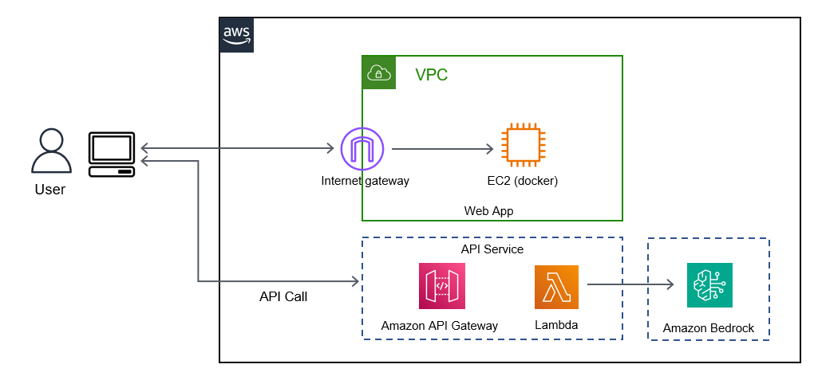
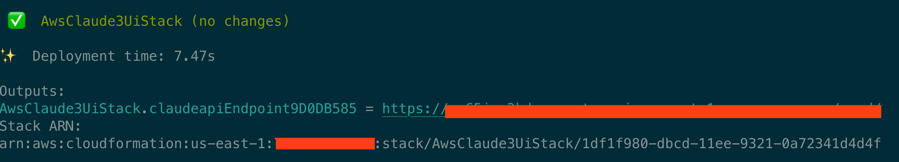
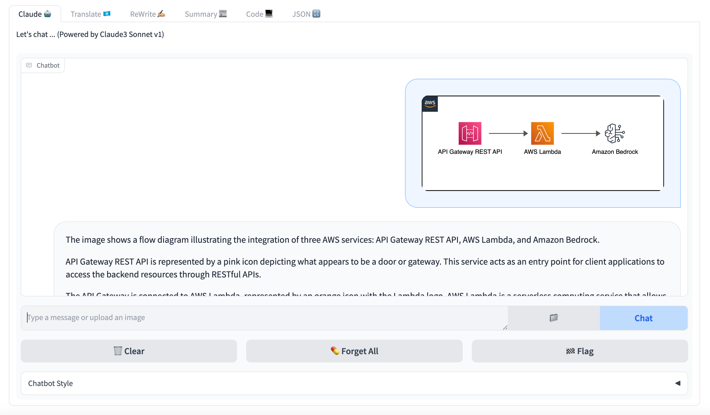
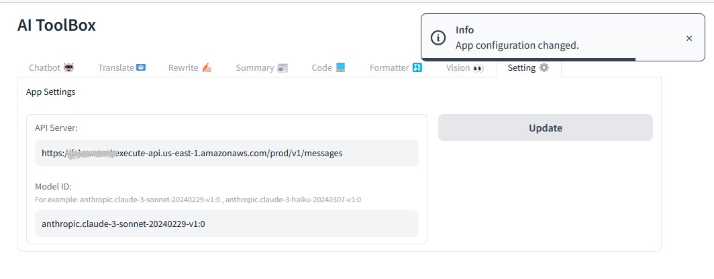

# AWS Bedrock Chat UI using Claude 3 model

**What does it do?**

- Creates an AWS Lambda function that interacts with AWS Bedrock

- Uses Anthropic's Claude 3 Sonnet model for chat

- Creates an AWS API Gateway endpoint to expose the API

- Converts the API of Claude3 model to the OpenAI Chat API format

- Deploy a Chat UI on AWS

  

**CDK Useful commands**

- npm install install dependencies
- cdk list list up stacks
- cdk deploy deploy this stack to your default AWS account/region
- cdk diff compare deployed stack with current state
- cdk synth emits the synthesized CloudFormation template

**Prerequisites**

First of all, AWS Account and IAM User is required. And then the following modules must be installed.please refer the [guide](https://docs.aws.amazon.com/cdk/v2/guide/getting_started.html#getting_started_prerequisites)

- AWS CLI: aws configure --profile [profile name]
- Node.js: node --version
- AWS CDK: cdk --version

### Install Guide

#### 1.Deploy Infrastructure using Claude 3 model

use aws cdk automatically deploy api gateway and lambda and call bedrock through lambda.

- install CDK: npm install -g aws-cdk

- install required libray:`npm i`

- deploy this stack to your default AWS account/region，get output api gateway url: `cdk deploy`

  

##### API Guide:

##### Create a Message:

Send a structured list of input messages with text and/or image content, and the model will generate the next message in the conversation.

The Messages API can be used for for either single queries or stateless multi-turn conversations.

Example with a single user message:

```json
{
  "model": "anthropic.claude-3-sonnet-20240229-v1:0",
  "max_tokens": 1024,
  "top_k": 1,
  "temperature": 0.5,
  "system": "Today is January 1, 2024.",
  "messages": [{ "role": "user", "content": "Hello, Claude" }]
}
```

Example with multiple conversational turns:

```json
{
  "model": "anthropic.claude-3-sonnet-20240229-v1:0",
  "max_tokens": 1024,
  "messages": [
    {
      "role": "user",
      "content": "Hello there."
    },
    {
      "role": "assistant",
      "content": "Hi, I'm Claude. How can I help you?"
    },
    {
      "role": "user",
      "content": "Can you explain LLMs in plain English?"
    }
  ]
}
```

with Claude 3 models, you can also send image content blocks:

```json
{
  "model": "anthropic.claude-3-sonnet-20240229-v1:0",
  "max_tokens": 1024,
  "messages": [
    {
      "role": "user",
      "content": [
        {
          "type": "image",
          "source": {
            "type": "base64",
            "media_type": "image/jpeg",
            "data": "image base64 data"
          }
        },
        {
          "type": "text",
          "text": "What is in this image?"
        }
      ]
    }
  ]
}
```

### Call API in claude's format by curl: /v1/messages

An example Claude messages API call looks like the following:

```bash
curl -X POST -k -H 'Content-Type: application/json' -i 'https://api_gateway_url/v1/messages' --data '{
    "model": "anthropic.claude-3-sonnet-20240229-v1:0",
    "max_tokens": 1024,
    "top_k":1,
    "temperature":0.5,
    "messages": [
        {"role": "user", "content": "Hello, Claude"}
    ]
}'
```

Response message:

```json
{
  "id": "msg_01XyWaKwckzDSNhjSrpEA73p",
  "type": "message",
  "role": "assistant",
  "content": [
    {
      "type": "text",
      "text": "Hello! It's nice to meet you. How can I assist you today?"
    }
  ],
  "model": "claude-3-sonnet-28k-20240229",
  "stop_reason": "end_turn",
  "stop_sequence": null,
  "usage": {
    "input_tokens": 20,
    "output_tokens": 19
  }
}
```

### Call API in openai's format by curl: /v1/chat/completions

An example OpenAI messages API call looks like the following:

```bash
curl -X POST -k -H 'Content-Type: application/json' -i 'https://api_gateway_url/v1/chat/completions' --data '{
    "model": "anthropic.claude-3-sonnet-20240229-v1:0",
    "max_tokens": 1024,
    "top_k":1,
    "temperature":0.5,
    "messages": [
        {"role": "user", "content": "Hello, Claude"}
    ]
}'
```

backend wil convert claude response to Openai compatible response message:

```json
{
  "choices": [
    {
      "finish_reason": "stop",
      "index": 0,
      "message": {
        "content": "Hello! It's nice to meet you. How can I assist you today?",
        "role": "assistant"
      },
      "logprobs": null
    }
  ],
  "created": 1709880244,
  "id": "msg_013gmWn1hnxqzAB2ku56u818",
  "model": "claude-3-sonnet-28k-20240229",
  "object": "chat.completion",
  "usage": {
    "completion_tokens": 19,
    "prompt_tokens": 10,
    "total_tokens": 29
  }
}
```

### 2.Deploy ui

1.Config API_SERVER value of .env under ui directory.

2.Build docker image and run ui container

```bash
docker build -t claude-ui .
docker run --env-file .env  -p 5006:5006  claude-ui
```



3.You can also change the API server and Model ID in the settings tab.


